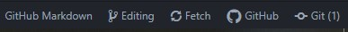
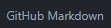
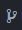

# TP1 seminario - Github Clasroom
 Template para tp1 de seminario

 ## Consigna:
 * El trabajo es por grupos de proyecto
 * Tienen que trabajar todos utilizando la metodologia del workflow de github
 * Organizar que parte del glosario hace cada uno por medio de la seccion de Issues
 * Cada alumno:
    * trabaja en su propia Branch
    * tiene que resolver por lo menos 1 issue del profesor
    * tiene que efectuar un pull request y resolver conflictos

## Forma de trabajo:

Descargar e instalar github desktop y el editor Atom (google it!!!)
 * Github Desktop:
  * Iniciar sesion
 * atom
  * si hace falta,   cerrar las pestañas no utiles y retraer el menu de project y Github/git
  * Linkear Github
  * selecionar grammar => markdown
  * Packages => Markdown Preview => Toggle Preview

 ### Completar el Siguiente Glosario:
 * Fork
 * Branch
 * Issue
 * Commit
   * Commit change
 * GiyHub Workflow
 * Pull Request
   * Compare Branch
   * Create Pull Request
   * Merge Pull Request
 * Conflicts
  * Conflicts Marks :
    * "<<<<<<<<<"
    * "========="
    * ">>>>>>>>>"

 * Reviews
  * obligatory Reviews
 * en atom y github desktop
  * Fetch
  * Push
  * Staged vs Unstaged Changes
 
## github desktop & Atom (Trabajo Local)

\[ayuda\]
#### Abajo a la derecha:

*  => Lenguaje del editor
*  Branch Actual
* Menu rapido de GIT
*  Acceso rapido a GitHub
*  Acceso rapido a GIT, entre parentesis aparecen cambios pendientes

#### Para trabajar con atom
Primero Guardar en atom (modificar el archivo)
Despues:
(si se quiere hacer el commit en Atom)      
1.    en el menu de GIT, doble click sobre el archivo con "unstaged changes" ( ahora son staged changes; click simple muestra los cambios en una pestaña nueva)
2. agregar el mensaje de commit y aoretar Commit to \[branch\]

3. ahora podemos pushear (abajo a la derecha: click en Push 1)
4. commit realizado, eventualmente habria que hacer un Pull, hacemos click(abajo a la derecha) en GitHub y nos muestra el menu para hacer el Pull Request

#### Para trabajar con Github Desktop
Primero Guardar en atom o hacer una modificacion en el repo
 1. escribir el comentario del Commit si no esta escrito
 2.hacer el commit (Local)
 3. hacer el Push ("commit" en la nube)

\[ayuda\]

